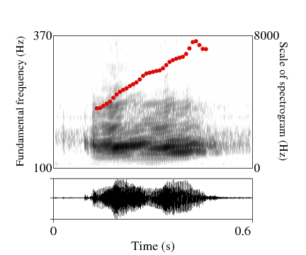
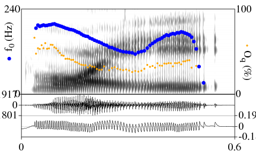
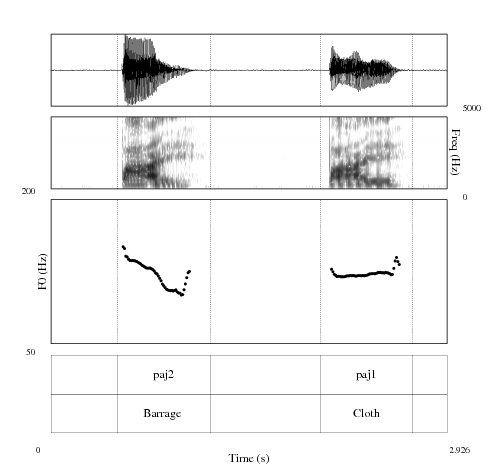

# praatfig

This repository offers scripts with elaborated instruction to help phoneticians (from beginner level) learn how to produce high quality figures on Praat (instead of taking screenshot from Praat's window). 

## Script #1: Simple script for beginner 
See [this folder](https://github.com/MinhChauNGUYEN/praatfig/tree/master/Script1_Beginner).

This script will be able to produce a figure like this:

 

## Script #2: Adding f0 and Oq values caculated by [Peakdet](https://github.com/alexis-michaud/egg/tree/master/peakdet_inter)
See this folder.

This script will be able to produce a figure like this:

 

## Script #3: An advanced script by [Francisco Torreira](http://cgussenhoven.ruhosting.nl/wordpress/wp-content/uploads/2018/01/byCourtesy_Francisco_Torreira.txt)
See [this folder](https://github.com/MinhChauNGUYEN/praatfig/tree/master/Script3_DrawObjects_byFranciscoTorreira)

This script will be able to produce a figure like this:

 

## Requiments
##
## Comments, suggestions, question, etc.
If you have a bug or an idea, please submit an issue to **MinhChauNGUYEN/praatfig** or contact me by email: minhchau.ntm@gmail.com 
