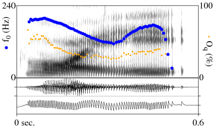

# praatfig

This repository offers scripts with elaborated instruction to help phoneticians (from beginner level) learn how to produce high quality figures on Praat (instead of taking screenshot from Praat's window). 

## Requiments
- Obviously, **Praat** software is required. Find the latest version at http://www.praat.org. 

**praatfig** assumes that the user already has some basic knowledge of **praat** such as: open and save objects, view and edit audio file, creat `TextGrid` file and annotate, etc.

- The output's format is **.eps** which allow editing text of image (replace the current text with your desired text or delete them). It helps to clean up some details of the figure which are much more complicated to deal with by script. In order to carry on this stuff, we need 2 supporting softwares: 

  - A plain text editor such as **Notepad++** for openning and manual editing the output figure.
  - A tool for viewing the **.eps** figure. Free software includes [**Eps viewer**](https://epsviewer.org/). (Note that EPS files cannot be displayed in this interface (GitHub), hence the use of `.png` or `.jpg` files for screen display.)

> EPS is a file extension for a graphics file format used in vector-based images in Adobe Illustrator. EPS stands for 
**Encapsulated PostScript**. It may contain 2D vector graphics, bitmap images, and text. 

## Script #1: Simple script for beginner 
See [this folder](https://github.com/MinhChauNGUYEN/praatfig/tree/master/Script1_Beginner) if you wish to be able to produce a figure like this:

 

## Script #2: Adding f0 and Oq values caculated by [Peakdet](https://github.com/alexis-michaud/egg/tree/master/peakdet_inter)
See [this folder] if you wish to be able to produce be able to produce a figure like this:

 

## Script #3: An advanced script by [Francisco Torreira](http://cgussenhoven.ruhosting.nl/wordpress/wp-content/uploads/2018/01/byCourtesy_Francisco_Torreira.txt)
See [this folder](https://github.com/MinhChauNGUYEN/praatfig/tree/master/Script3_DrawObjects_byFranciscoTorreira) if you wish to be able to produce a figure like this:

 

## Comments, suggestions, question, etc.
If you have a bug or an idea, please submit an issue to **MinhChauNGUYEN/praatfig** or contact me by email: minhchau.ntm@gmail.com 
