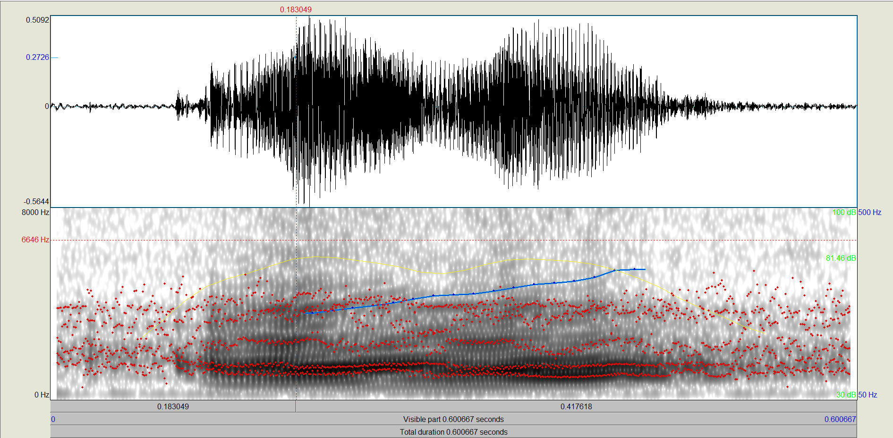
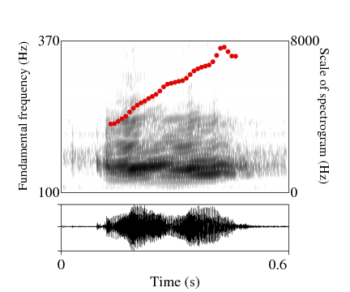
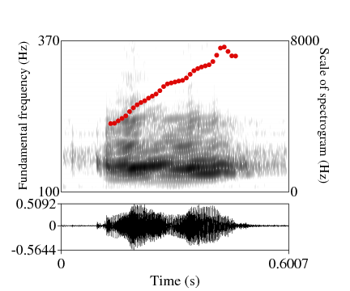

# praatfig #1: a beginner-level tutorial  

This demo provides a simple script for learning and practising how to draw the most basic objects (including spectrogram, pitch and sound) on `Praat Picture`. 

It was prepared for a training session at LPP (Laboratoire de Phonétique et Phonologie), March 2019.

## Introduction

Figures produced from Praat often look like... this:

 

The goal of this tutorial is to get this result instead: 

 

In a nutshell: what we want is clear axes, crisp contrast, and sharp lines. To achieve this, the final output file is not **raster** (.jpg, .png), but **vector**. Some figures look great on screen but terrible when zoomed in or printed. For explanations about this, visit: https://userblogs.fu-berlin.de/langsci-press/2016/12/12/graphics-and-images/. 

## Input equirement
- **Short audio file(s)**: for practice, use the sound of this demo for a start. This is a recording of a Vietnamese tone from the year 1900, courtesy of the [CREM archive](https://archives.crem-cnrs.fr/archives/items/CNRSMH_I_1900_001_004/). Later when you know exactly what you need to do, you can use any excerpt from your own data, of course. 

## Instructions

1. **Open Praat software**

2. **Prepare input files and put them in the same folder as the script (extension .PraatScript)** 

The script is named **Praatfig1_beginner.PraatScript** in this demo. 
The input files depend on what you want to display (and highlight) in the figure, of course. In this demo we need: (i) sound (extension `.Sound`), (ii) spectrogram (extension `.Spectrogram`), (iii) pitch (extension `.pitch`). You can also have intensity, formant, or pulse. 

The way to prepare these inputs is that: 
- (On window *'Praat Object'*) open sound file `Open`/ `Read from file` > select `view and edit`
- (On toolbar of the new window for view and edit) select and extract the object which you want to display, for instance here we select `Spectrum`/ `Extract visible spectrogram`. 
- (On window *'Praat Object'*) a new file is created named **Spectrogram untitled**, you need to save this file by selecting `Save`/ `Save as text file...`. 
- You can extract other objects by the same process.

3. **Open the script**
(On window *'Praat Object'*) select `Praat`/ `Open Praat script`

4. **Update input information in available script, adjust the script until you are satified with the figure.**

When using the script for a new sound file, we should 
- Make a copy of the `.PraatScript` file and rename it;
- Change the information of **Loading the data** in command `Read from file...` and **Exporting the output file** in command `Save as EPS file...`. 

Other modification is also possible if it's necessary.

5. **Run the script (Shortcut: `Ctrl + R`)**

6. **Clean up the EPS graphic figure by Notepad++**
- Open the output file in **Notepad++**, 
- Find the **text** (legends) or **number** (axes's points) that need to be modified or deleted (shortcut: `Ctrl + F`)
- Make manual changes.
- At the same time you need to consider the figure by EPS viewer to make sure your changes are correct. 

For example, in this demo, there are four places that have been modified: rounding time to 0.6 sec (not 0.6007; Praat leaves responsibility for sensible rounding of figures to the user); and remove the three numbers '0.5092', '-0.5644', and '0' (on vertical axes of acoustic signal). Following is the output figure before and after cleaning by **Notepad++**

Output figure before cleaning | Output figure after cleaning
----------------------------- | ----------------------------
 | 

### Some notes
1. **Outer viewport** vs **Inner viewport** 

Both of them are the ways to determine where your next drawing will occur by selecting the part of the Picture window. While the outer viewport includes the margins, the inner viewport does not. It's corresponding to the action you select the viewport by dragging your mouse arcoss the window **Praat Picture**. Althoght they can be used interchargeable, `Select inner viewport` offer an easier view for drawing the main objects such as *spectrogram, audio,* etc; whereas `Select outer viewport` is easer for setting information surround (including axes and legends), or choosing the entire figure for saving. 

2. **With** vs **Without** box or axes 

 When drawing any object, there is an option is **Garnish**. If you select this option (correspoding to `"yes"` on the script), the box or the axis and the legends will be created automatically which is good for drawing one single object. When you would like to combine two or more than two objects (spectrogram + audio + pitch, for instance), it will be better to draw without **Garnish**, then later we can use command `Draw inner box` to make the box and set the axes and legends exaclty where and what we want. This way is cleanser and no conflict between objects. 
 
 3. Writing a simple script yourself with `Paste history`
 
This script is actually a record of all the actions that you can do on **Praat Objects** and **Praat Picture**. In other words, without a script you are still be able to make the target figure above by using available functions on those two windows of Praat.  
So, *why we need a script?*
The answer is:
- It's easier: a script can perform accurately an action many times, which is difficult by manually setting. For instance, commands such as `select inner viewport` or `select outer viewport` are totally difficult to select manually at the proper margins. 
- With an available script, it's much faster to produce many figures with the same scales (mass production).

Until you understand this simple script and know what are basic steps to draw an object, you will be able to edit this script, or even write a new script to serve your own purpose. The way to do is: (i) always begin with `Clear history`, (ii) carry out manually the function(s) you want on windows of Praat, (iii) `Paste history` to learn and save the structure of command(s).

---Good luck---

